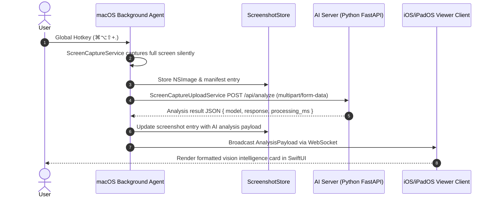

# Clients Architecture & Project Intent — `clients/`

## Overview

The `clients/` workspace contains multi-platform client nodes for the **Screen Intelligence Pipeline**:
1. **macOS Background Agent** (`macos-ai-screening-assistant`): Silent screen capture node running without a Dock icon. Captures screen frames via `ScreenCaptureKit` upon hotkey trigger (`⌘⌥⇧+.`) and dispatches image analysis payloads to the AI Inference Server.
2. **iOS/iPadOS Viewer Client** (`ios-ai-screening-assistant`): Real-time analysis viewer. Receives and renders vision intelligence analysis streamed from the macOS node via WebSocket.

---

## Data Flow & Pipeline Architecture



---

## Directory Structure

```
clients/ai-screening-assistant/
├── ai-screening-assistant.xcworkspace/        # Master Xcode workspace
├── macos-ai-screening-assistant/               # macOS Background Agent Source
│   ├── macos_ai_screening_assistantApp.swift  # App entrypoint, menu bar, hotkeys, OTel
│   ├── Screenshots.swift                      # ScreenshotStore (NSObject), CaptureManager
│   ├── ScreenCaptureUploadService.swift       # Multipart HTTP uploader to /api/analyze
│   ├── KeyBindings.swift                      # Hotkey controller & modifier parsing
│   └── OtelTracing.swift                      # Swift OpenTelemetry tracer & exporter
├── macos-ai-screening-assistantTests/          # XCTest Unit Test Suite (36 tests)
│   ├── KeyBindingsTests.swift                 # 26 keybinding tests
│   ├── ScreenshotsTests.swift                 # 8 capture & storage tests
│   └── UploadServiceTests.swift               # 2 HTTP upload & API error handling tests
└── ios-ai-screening-assistant/                # iOS/iPadOS Viewer Client Source
    ├── ios_ai_screening_assistantApp.swift    # App entrypoint
    ├── WebSocketClientManager.swift           # WebSocket subscriber & payload decoder
    └── ContentView.swift                      # SwiftUI Screen Intelligence Dashboard
```

---

## Key Technical Invariants

1. **Headless macOS Agent**: The macOS client is configured as an accessory background process (`LSUIElement = YES`, `NSApp.setActivationPolicy(.accessory)`). It **never renders AI text directly on the macOS screen**.
2. **`ScreenshotStore: NSObject`**: `ScreenshotStore` **must** inherit from `NSObject` to prevent Swift-only object deallocation double-free crashes in XCTest environments.
3. **App Sandbox Disabled**: App Sandbox is disabled because global hotkey listeners (`CGEvent` / `NSEvent` global monitors) are blocked under sandboxing.
4. **Xcode Synchronization**: Uses Xcode 16+ `PBXFileSystemSynchronizedRootGroup`. Files added to `macos-ai-screening-assistant/` or `macos-ai-screening-assistantTests/` are automatically compiled.
5. **Parallel Testing**: Tests require single-threaded execution (`-parallel-testing-enabled NO`) to prevent global hotkey event monitor collisions.

---

## Developer Commands

Run all tasks using `mise`:

| Task | Description |
|---|---|
| `mise run test:macOS` | Runs full macOS XCTest suite (36 tests) |
| `mise run build:macOS` | Builds macOS Debug app bundle |
| `mise run lint:macOS` | SwiftLint strict validation |
| `mise run format:macOS` | Code formatting via SwiftFormat |
