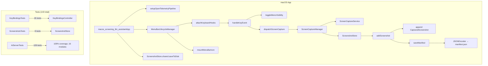
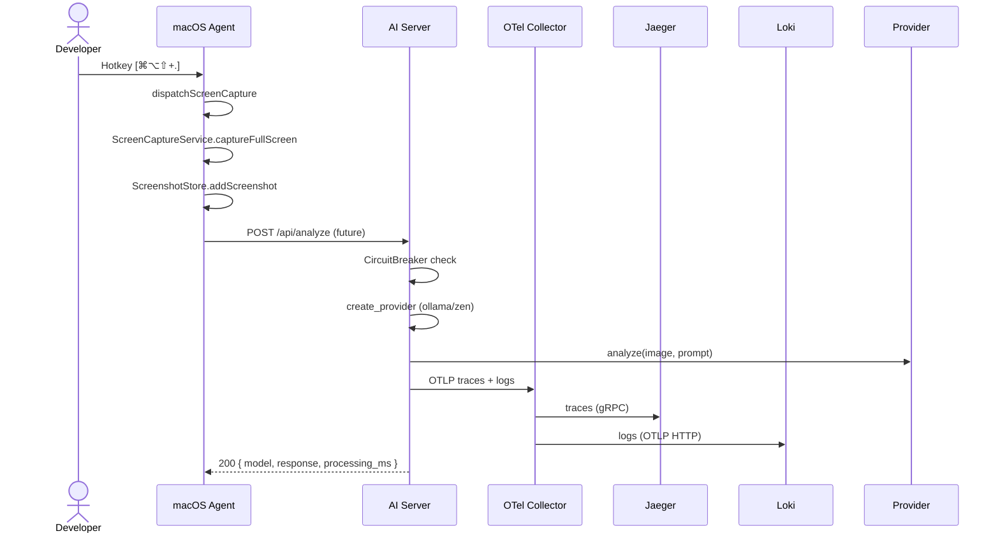
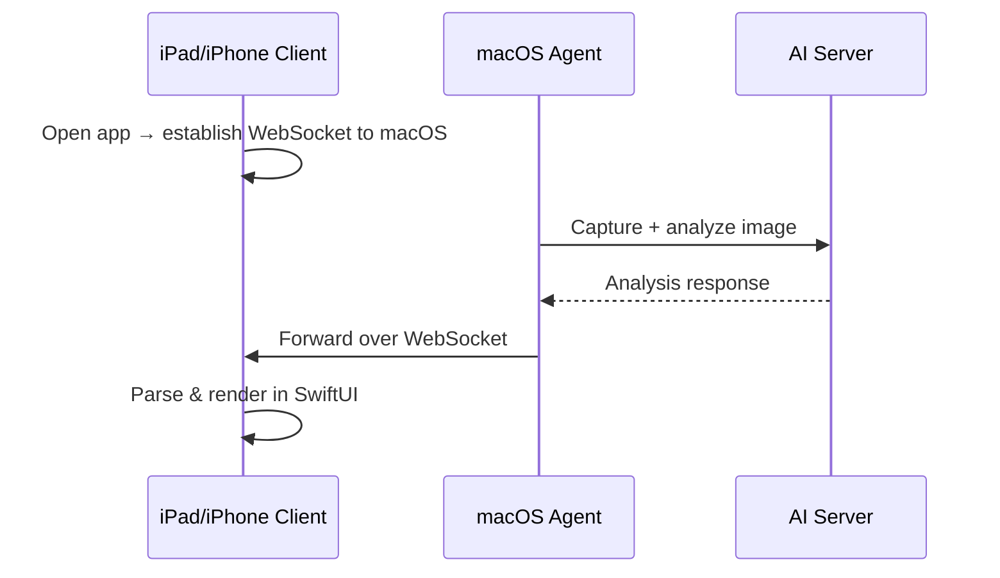

# Screening LLM Assistant — Architecture & Roadmap

## Overview

A multi-platform pipeline that captures macOS screen content via hotkeys, sends it to an AI inference server, and displays analysis results on iPad/iPhone. The macOS node is a background agent (no Dock icon). All LLM output renders exclusively on the mobile client.

---

## Current Architecture (v0.1)

### Components

| Component | Stack | Role |
|-----------|-------|------|
| **macOS App** | SwiftUI + AppKit | Background agent; keyboard hooks, screen capture, local screenshot store |
| **AI Server** | Python FastAPI (uv-managed) | Image analysis via Ollama or OpenCode Zen API |
| **Dev Stack** | Docker, OTel Collector, Jaeger, Loki, Prometheus, Grafana, cAdvisor | Full observability pipeline |
| **iOS App** | SwiftUI | (scaffold) placeholder for future supervisor client |

### Port Map

| Port | Service | Access |
|------|---------|--------|
| 8000 | AI Server (FastAPI) | Public (app) |
| 8001 | Health checks (liveness/readiness) | `127.0.0.1` only on host |
| 9000 | Prometheus metrics | Internal Docker network only |
| 4317/4318 | OTel Collector (gRPC/HTTP) | Internal |
| 16686 | Jaeger UI | Host |
| 3000 | Grafana | Host |
| 9090 | Prometheus UI | Host |
| 3100 | Loki | Internal |
| 11434 | Ollama | Internal |

### macOS Module Map



### AI Server Module Map

```mermaid
graph TB
    subgraph "AI Server (FastAPI)"
        App[create_app] --> Lifespan[lifespan]
        Lifespan --> Log[setup_logging]
        Lifespan --> Health[HealthCheckServer :8001]
        Lifespan --> OTel[setup_otel]
        OTel --> Tracer[TracerProvider → Jaeger]
        OTel --> Logging[LoggingInstrumentor]
        OTel --> Fast[FastAPIInstrumentor]
        OTel --> HTTPX[HTTPXClientInstrumentor]
        Lifespan --> Ready[set_ready]

        App --> Router[router]
        Router -->|GET /api/health| H200[200 OK]
        Router -->|GET /health/live| Live[alive]
        Router -->|GET /health/ready| ReadyCB[circuit_breaker state]
        Router -->|POST /api/analyze| Analyze[analyze]
        Analyze --> CB[CircuitBreaker]
        Analyze --> Provider[create_provider]
        Provider --> Ollama[OllamaProvider]
        Provider --> Zen[ZenProvider]

        App --> Metrics[setup_metrics]
        Metrics --> M[metrics_port=9000 ➔ /metrics on separate HTTP server]
        Metrics -->|metrics_port=0| Inline[/metrics endpoint on main app]

        App --> LocalOnly[local_only middleware]
        LocalOnly -->|public IP → /docs| 403[403 Forbidden]
    end

    subgraph "Observability (Docker)"
        HS[HealthCheck :8001] -->|docker healthcheck| Container
        M2[Metrics :9000] -->|scrape| Prometheus
        OTel2[OTel :4318] -->|traces| Jaeger
        OTel2 -->|logs| Loki
    end
```

### API Endpoints

| Method | Path | Description |
|--------|------|-------------|
| `GET` | `/api/health` | Legacy health check (alias for liveness) |
| `GET` | `/health/live` | Kubernetes liveness probe |
| `GET` | `/health/ready` | Kubernetes readiness probe (includes circuit breaker state) |
| `POST` | `/api/analyze` | Analyze image (multipart: `file` + `prompt`) |
| `GET` | `/docs` | Swagger UI (local IP only) |
| `GET` | `/redoc` | ReDoc UI (local IP only) |
| `GET` | `/openapi.json` | OpenAPI spec (local IP only) |
| `GET` | `/metrics` | Prometheus metrics (when `metrics_port=0`) |

### AI Server Source Files

| File | Lines | Purpose |
|------|-------|---------|
| `main.py` | 111 | `create_app()`, `lifespan`, middleware registration, module-level `app` |
| `router.py` | 125 | API routes (`/api/analyze`, `/health/*`), circuit breaker integration |
| `config.py` | 92 | `Settings` with TOML + env vars (prefix `AI_SERVER_`) |
| `circuit_breaker.py` | 85 | CLOSED→OPEN→HALF_OPEN state machine, `failure_threshold=5`, `recovery_timeout=30s` |
| `metrics.py` | 104 | Prometheus metrics on separate port or inline; 9 metric instruments |
| `otel.py` | 79 | OpenTelemetry setup: traces → Jaeger, logs → Loki, FastAPI/httpx logging instrumentation |
| `health_server.py` | 51 | Separate HTTP server on port 8001 for isolated health probes |
| `local_only.py` | 24 | Middleware blocking `/docs`, `/redoc`, `/openapi.json` from public IPs |
| `logging.py` | 39 | Structured JSON logging (K8s format), `JsonFormatter`, `setup_logging` |
| `schemas.py` | 34 | Pydantic models for request/response |
| `providers/base.py` | 21 | `AnalysisProvider` ABC, `AnalysisResult` dataclass |
| `providers/ollama.py` | 46 | Ollama vision API client |
| `providers/zen.py` | 52 | OpenCode Zen API client (OpenAI-compatible, base64 inline images) |
| `providers/factory.py` | 23 | Provider factory dispatching on `settings.provider` |

### Observability Stack

| Service | Image | Role |
|---------|-------|------|
| OTel Collector | `otel/opentelemetry-collector-contrib` | Receives OTLP traces/logs, exports to Jaeger/Loki |
| Jaeger | `jaegertracing/all-in-one` | Distributed tracing UI (`:16686`) |
| Loki | `grafana/loki:latest` | Log aggregation (`:3100`, OTLP ingest) |
| Prometheus | `prom/prometheus:latest` | Metrics scraping (`:9090`) |
| Grafana | `grafana/grafana:latest` | Dashboard UI (`:3000`, auto-provisioned) |
| cAdvisor | `gcr.io/cadvisor/cadvisor` | Container resource metrics |

### Test Suite

**109 AI Server tests (100% coverage, 16 modules, 482 statements):**

| Module | Tests | Coverage |
|--------|-------|----------|
| `schemas.py` | 7 | 100% |
| `config.py` | 8 | 100% |
| `circuit_breaker.py` | 8 | 100% |
| `router.py` | 12 | 100% |
| `providers/` | 11 | 100% |
| `main.py` | 14 | 100% |
| `otel.py` | 3 | 100% |
| `metrics.py` | 1 | 100% |
| `logging.py` | 4 | 100% |
| `health_server.py` | 5 | 100% |
| `local_only.py` | 10 | 100% |
| **e2e (integration)** | 9 | N/A |

**34 macOS tests (XCTest):**

| Suite | Tests |
|-------|-------|
| KeyBindingsTests | 26 |
| ScreenshotsTests | 8 |

---

## Architecture (v0.1 — Current)

### Data Flow



### Robustness

- **Circuit Breaker** — Wraps provider calls; opens after 5 consecutive failures, auto-recovers after 30s. Open circuit → HTTP 503. State exposed via `/health/ready`.
- **Separate Health Server** — Port 8001 runs an isolated `http.server.HTTPServer` daemon thread for Docker healthchecks. Never affected by app load or crashes.
- **Structured JSON Logging** — `JsonFormatter` outputs one JSON object per line (Kubernetes standard): `timestamp`, `level`, `message`, `logger`, `module`, `function`, `line`, optional `exception` and custom `props`.
- **Local-Only Docs** — Middleware returns 403 on `/docs`, `/redoc`, `/openapi.json` from public IPs.
- **Port Isolation** — Health (8001) and metrics (9000) bound to `127.0.0.1` on host; app (8000) exposed normally.
- **HVROn-call only instrumentation** — `FastAPIInstrumentor.instrument_app(app)` instruments the existing module-level app instance (not just future instances).

### Key Technical Decisions

1. **`ScreenshotStore: NSObject`** — Required to prevent Swift-only deallocation double-free in XCTest.
2. **Lazy `captureManager`** — Test processes never initialize the capture pipeline.
3. **XCTest guard** — `dispatchScreenCapture()` checks `XCTestConfigurationFilePath` env var.
4. **OTLP HTTP** — JSON-over-HTTP OTLP (not gRPC) to avoid `grpc-swift` dependency.
5. **`uv` package manager** — Fast Python dependency resolution and sync.
6. **FastAPI lifespan** — Settings loaded from TOML + env vars (`AI_SERVER_` prefix); health server, OTel, and readiness all managed in lifespan.

---

## Roadmap — Future Architecture (v1.0)

### Step 1: macOS → Server Image Posting

`ScreenCaptureUploadService` (conforming to `ScreenCaptureProviding`) will:
1. Capture screen via `ScreenCaptureKit`
2. Convert to PNG/JPEG
3. `POST` multipart to `/api/analyze`
4. On success, store response alongside local `CapturedScreenshot`

### Step 2: Free AI Endpoints (planned)

| Endpoint | Status |
|----------|--------|
| HuggingFace Inference API | Config struct exists |
| Groq Cloud | Config struct exists |
| Google Gemini API | Config struct exists |
| Cloudflare Workers AI | Config struct exists |
| Ollama (local) | **Implemented** |
| OpenCode Zen | **Implemented** |

### Step 3: iOS/iPadOS Client — Render AI Response



### Directory Topology

```
.
├── apps
│   ├── macos-ai-screening-assistant    # Capture node: SwiftUI + AppKit
│   │   ├── macos-ai-screening-assistant/
│   │   └── macos-ai-screening-assistantTests/
│   └── ios-ai-screening-assistant      # (scaffold)
├── services
│   └── ai-server                        # Python FastAPI, uv-managed
│       ├── src/ai_server/
│       │   ├── main.py                  # FastAPI app + lifespan
│       │   ├── router.py                # Routes
│       │   ├── config.py                # Settings
│       │   ├── circuit_breaker.py       # Resilience
│       │   ├── metrics.py               # Prometheus
│       │   ├── otel.py                  # OpenTelemetry
│       │   ├── health_server.py         # Separate health HTTP server
│       │   ├── local_only.py            # Docs IP restriction
│       │   ├── logging.py               # Structured JSON logging
│       │   ├── schemas.py               # Pydantic models
│       │   └── providers/               # AI provider implementations
│       ├── configs/config.toml          # Default config
│       ├── tests/                       # 109 tests (unit + e2e)
│       └── Dockerfile                   # 3-stage build, uv, tini, non-root
├── docs
│   ├── README.md                        # This file
│   └── MANIFEST.md
└── development
    ├── docker-compose.yml               # Full stack
    ├── docker-compose.api.yml           # API-only compose
    ├── docker-compose.observability.yml # Observability-only compose
    ├── otel-collector/otel-collector-config.yaml
    ├── prometheus/prometheus.yml
    ├── grafana/
    │   ├── provisioning/
    │   └── dashboards/otel-overview.json # 18 panels, 5 rows
    └── loki/loki-config.yaml
```

---

## Development

### Prerequisites

- Xcode 15+ (macOS 14+)
- Swift 5.10+
- mise (for tool version management)
- Docker (for local observability stack)
- Python 3.14+ (for AI server)

### Running macOS Tests

```bash
xcodebuild test \
  -project clients/ai-screening-assistant/macos-ai-screening-assistant.xcodeproj \
  -scheme "macos-screening-assistant" \
  -destination "platform=macOS" \
  -parallel-testing-enabled NO
```

### Building macOS App

```bash
xcodebuild build \
  -project clients/ai-screening-assistant/macos-ai-screening-assistant.xcodeproj \
  -scheme "macos-screening-assistant" \
  -destination "platform=macOS" \
  -configuration Debug
```

### Running macOS App

```bash
xcodebuild test-without-building \
  -project clients/ai-screening-assistant/macos-ai-screening-assistant.xcodeproj \
  -scheme "macos-screening-assistant" \
  -destination "platform=macOS" \
  -parallel-testing-enabled NO
```

### Running AI Server Tests

```bash
mise run test:ai-server       # unit tests only
mise run test:ai-server-e2e   # e2e tests only (requires mock server)
mise run test:ai-server-all   # all tests
```

### Local Observability Stack

```bash
mise run compose-up
# or directly:
docker compose -f development/docker-compose.yml up -d

# Open UIs:
open http://localhost:3000   # Grafana (admin/admin)
open http://localhost:16686  # Jaeger
open http://localhost:9090   # Prometheus
```

### AI Server Configuration

Config sources (priority order):

1. Constructor arguments (code)
2. Environment variables (`AI_SERVER_*`)
3. `.env` file
4. `configs/config.toml`
5. `configs/config.{environment}.toml` (e.g., `configs/config.test.toml`)

Key env vars:

| Variable | Default | Purpose |
|----------|---------|---------|
| `AI_SERVER_PROVIDER` | `ollama` | AI provider (`ollama` or `zen`) |
| `AI_SERVER_DEFAULT_MODEL` | `llama3.2-vision` | Default model name |
| `AI_SERVER_OLLAMA_BASE_URL` | `http://localhost:11434` | Ollama endpoint |
| `AI_SERVER_ZEN_API_KEY` | `""` | OpenCode Zen API key |
| `AI_SERVER_OTEL_COLLECTOR_ENDPOINT` | `""` | OTel collector HTTP endpoint |
| `AI_SERVER_METRICS_PORT` | `0` | Separate metrics port (0 = inline on app) |
| `AI_SERVER_HEALTH_PORT` | `8001` | Separate health check port (0 = disabled) |
| `AI_SERVER_LOG_LEVEL` | `INFO` | Log level |
| `AI_SERVER_CB_FAILURE_THRESHOLD` | `5` | Circuit breaker failure threshold |
| `AI_SERVER_CB_RECOVERY_TIMEOUT` | `30` | Circuit breaker recovery timeout (seconds) |

---

## Runbook

See **[RUNBOOK.md](RUNBOOK.md)** for all build, test, and run commands (xcodebuild, mise, docker, etc.).
